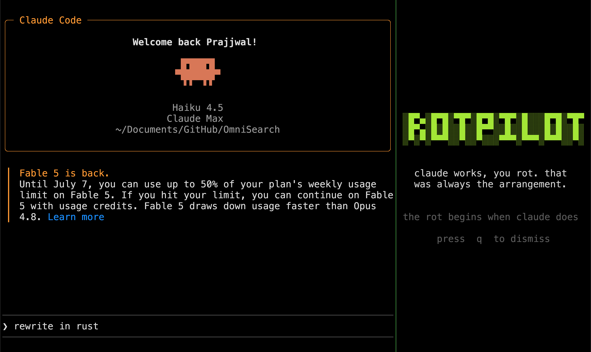
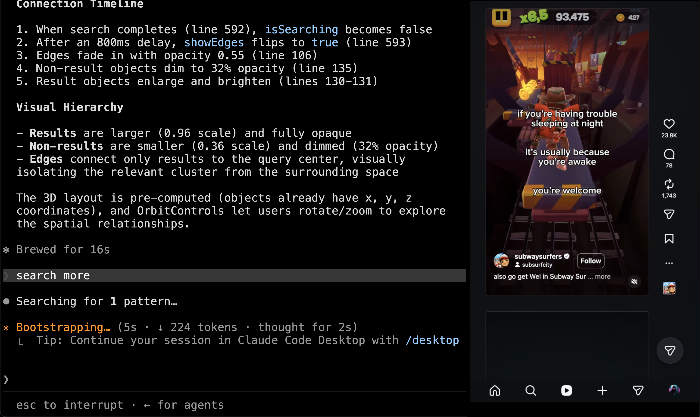
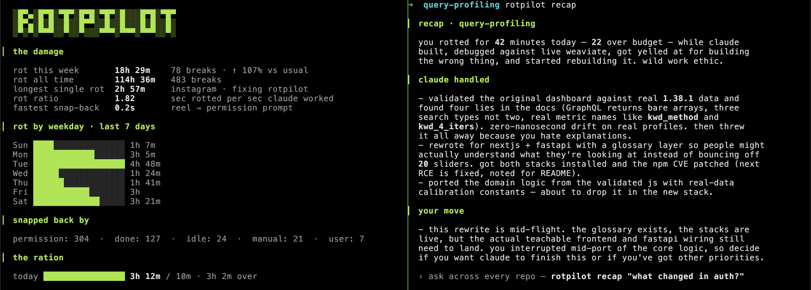

<div align="center">

# rotpilot

**claude works, you rot.** 

<!-- [](https://nodejs.org) -->
[](./LICENSE)



</div>

rotpilot is a Claude Code companion (Codex and OpenCode support might come soon). While Claude is working, it plays short-form video **inside your terminal**, in a proper 9:16 portrait crop, as a side panel right next to Claude's output so you can pretend you're still supervising. The moment Claude needs a permission or finishes, the panel collapses, a ding plays, and focus snaps back to Claude. The AI is babysitting your attention span: it feeds you brainrot while it works and takes it away when it needs you.

<p align="center">
  
</p>

Your rot is tracked. `rotpilot stats` shows the damage.

<p align="center">
  
</p>


## Install

```sh
npm install -g rotpilot
rotpilot init
```

Then run Claude Code **in kitty or Ghostty**, give it something chunky to do, and rot. That's it — the daemon boots itself, and the feed starts the moment you submit a prompt, so even Claude's thinking time is rot time.

**Ghostty (≥1.3)** works out of the box — the panel docks via Ghostty's AppleScript API (macOS asks once for Automation permission the first time).

**kitty** needs remote control for the default side-panel mode — add two lines in `~/.config/kitty/kitty.conf`, then restart kitty:

```
allow_remote_control socket-only
listen_on unix:/tmp/kitty
```

Without it, rotpilot falls back to a separate kitty window. Switch explicitly with `rotpilot window panel|window`.

**Restart any running Claude sessions after `rotpilot init`** — hooks load at session start.

Once the panel appears it **stays in view**: on a snap-back the video freezes and the panel roasts you ("claude finished. one of you had to.") until Claude gets back to work — then the rot resumes instantly, same panel. It fully closes only when you press q, the session ends, or you turn rotpilot off.

### Controls

Click the panel to give it focus, then:

- **↑ / ↓** — scroll the feed by hand. The auto-advance notices and re-times itself around the clip you land on
- **p** — pause the rot yourself. Same frozen panel you get when Claude needs you, and it *stays* paused: Claude getting back to work won't undo it
- **r** — resume. Works out of any pause, including one Claude caused
- **q** (or esc) — closes the TV (and the engine Chrome) and snoozes until your next prompt

A held **p** is released by **r** or by your next prompt — the same contract as **q**.

### Making it stop

- press **q** (or esc) inside the TV — closes it (and the engine Chrome) and snoozes until your next prompt
- `rotpilot off` — turns rotpilot off **for the current project** (removes its hooks there; other projects unaffected; takes effect immediately)
- `rotpilot stop` — kills the daemon, Chrome, and the TV

rotpilot is **per-project and terminal-only**: `rotpilot on` in a project turns it on there (hooks go into that project's `.claude/settings.local.json`, never your global settings), and it only activates when Claude runs inside kitty or Ghostty — the desktop app and IDE extensions never trigger it.

## Commands

| command | what |
|---|---|
| `rotpilot init` | install hooks into Claude Code (idempotent; `rotpilot off` to remove) |
| `rotpilot demo` | 30 seconds of the full loop, no Claude needed |
| `rotpilot stats` | your rot report — rot ratio, rot by weekday, trend vs usual, your budget meter. screenshot it, you coward |
| `rotpilot recap` | what you missed this session, plus everything still waiting on you. `--all` / `"question"` reach across sessions & repos (Engram) |
| `rotpilot budget <amount>` | set a rot ration stats holds you to — `budget 10m` (daily), `budget 1h --weekly`, `budget off` |
| `rotpilot engram` | set up the Engram memory (`key` / `id` / `transcripts on\|off` / `check`) |
| `rotpilot feed <name>` | switch feed: `localLoop` \| `shorts` \| `instagram` (`--accept-risk` to opt into Instagram) |
| `rotpilot loop` | optional: fetch the Subway Surfers clip `localLoop` plays (~20 MB via yt-dlp) |
| `rotpilot window <mode>` | `panel` (split beside Claude, default) \| `window` (separate) |
| `rotpilot on` / `off` | per-project switch — turn the rot on/off for the current project |
| `rotpilot status` / `start` / `stop` | daemon control |
| `rotpilot uninstall` | full cleanup: daemon, chrome, hooks, and all local data |

### Requirements (v1)

- **macOS**
- **[kitty](https://sw.kovidgoyal.net/kitty/)** or **[Ghostty](https://ghostty.org) ≥1.3** — the two terminals with real APIs for all three things rotpilot needs: graphics, focus control, and pane spawning.
- **Google Chrome** — the video engine. rotpilot drives a real, headful Chrome (isolated profile, never your own) and live-captures it into the terminal.
- **Node 20+**
- **[yt-dlp](https://github.com/yt-dlp/yt-dlp)** (optional, `brew install yt-dlp`) — only for the default `localLoop` feed. `rotpilot init` never downloads anything; run `rotpilot loop` when you want the Subway Surfers clip fetched into your own config dir (~20 MB, never bundled or redistributed). Without it `localLoop` plays a built-in canvas animation. Not needed for `shorts`.

## Feeds

- **`localLoop`** (default) — a bundled, network-free gameplay loop. Safe, zero accounts. Drop your own video at `~/.config/rotpilot/loop.mp4` and it plays that instead.
- **`shorts`** — real YouTube Shorts, auto-advancing with a human-paced dwell.
- **`instagram`** — your actual Reels. **Opt-in only, at your own risk**. You must set `"allowInstagram": true` in the config by hand; there is no flag to fat-finger.

## How it works

```
claude code hook ──▶ rotpilot hook <event> ──unix socket──▶ rotpilotd
                                                              │
                              prompt submitted ──▶ play (thinking time is rot time)
                                                              │
                                        headful Chrome ──CDP screencast──▶ PNG frames
                                                              │
                                        kitty graphics protocol ──▶ your terminal
                                                              │
                         permission / done ──▶ freeze + roast, ding, focus snaps back
```

- The "claude is working" hooks are `async` — a dead daemon can never slow down or break a Claude session (the hook client no-ops in ~45ms). The pause hooks are deliberately sync: `PermissionRequest` fires *before* the dialog is painted, so the feed is already frozen by the time you see it.
- Chrome runs headful with an isolated profile and anti-throttle flags; the window hides behind your terminal. You watch the *terminal*. Chrome is just the engine.
- Read-only by design: rotpilot scrolls to watch. It will never like, follow, comment, or DM.

## Memory

Every snap-back is recorded locally (`~/.config/rotpilot/rot.json`): what Claude was working on, how long you rotted, why you got yanked back, and how fast you responded. **No data leaves your machine unless you opt in below.**

### 👀 While you rotted (instant, local)

Every snap-back screen prices what just streamed by, parsed locally from the session transcript — no key, no network, works from your first rot.

`rotpilot recap` catches you up on **this session** the same way: it reads the current Claude Code transcript directly and synthesizes a sardonic briefing with **your own** Claude (the `claude` CLI you already have) — no key, no opt-in, nothing leaves your machine. This is the 95% case: "what did I miss just now."

`rotpilot budget 10m` hands rotpilot a daily rot ration (or `1h --weekly`). `rotpilot stats` then shows a **live meter** — `today ███████░░░ 7m / 10m · 3m left` — plus a days-under-budget streak, and the recap roast knows when you've blown past it ("*you burned through your 10-minute budget by 9am*"). `rotpilot budget off` to drop it.

### 🧠 Across time & repos (Engram, opt-in)

Here's the thing local can't fix. **Every question Claude asks while you're rotting dies with the session that asked it.** Claude Code writes one JSONL transcript per session and rotates them — so "what was Claude waiting on me for, in the other repo, last Tuesday?" is permanently unanswerable from your disk. `rotpilot stats` prices the leak for you:

```
▎ loose ends

  claude asked you 14 things this week while you weren't looking.
  those sessions are gone, and took the questions with them.
```

[Engram](https://docs.weaviate.io/engram) is what keeps them. It's off by default, entirely opt-in, and rotpilot is fully functional without it — but it buys you one thing nothing else can: the **second half of every recap**.

`rotpilot recap` always prints two sections. The first — *this session* — is local and needs nothing. The second — *still on you* — is **a standing to-do list you never wrote**: every question, approval, and warning Claude surfaced while you weren't looking, across *every* repo and *every* session, most overdue first. Without Engram that section just tells you what it would hold; with it:

```
▎ still on you

  you've got ten things hanging from three different projects, oldest
  gathering dust since july 2nd. twenty-five days, and the only movement
  has been you refreshing your phone 124 times.

  · decide whether to apply claude's fix to aura/views/posts.py  (aura)
  · claude never ran the grep it offered in OmniSearch/frontend  (omnisearch)
  · pick a demo shape — it's been waiting on you since monday  (playground)
```

Engram's extraction pipeline does the did-vs-needs-you split by reading the dialogue (rotpilot parses nothing), and its merge step folds the same unanswered question from three sessions into one line instead of three. `--days` widens the window (default 14). Setup: [Engram Quickstart](./docs/engram-quickstart.md). Two more modes come free with it:

```
rotpilot recap --all                    # this repo, across every past session — not just this one
rotpilot recap "what changed in auth?"  # ask anything, across every project you ever rotted through
```

You watched reels; your memory watched Claude. Weeks later, in any repo, you can ask what happened while you weren't looking — and get a straight, honest answer, not a log dump:

```
▎ recap · aura

▎ all sessions

  you were doom-scrolling while claude actually debugged your code. lines
  720-724 in posts.py: exception handler was killing the original image url,
  causing campaign images to fail silently. tragic, honestly.

  · found it: loop var `img` gets clobbered after `_url_to_data_uri()`
  · rewrote the handler to preserve the source url and added a regression test

▎ still on you

  four things hanging across three repos, oldest waiting 26 days.

  · aura (3d): green-light the posts.py fix — claude is blocked on you
  · playground (26d): pick a demo shape, you were asked and said nothing
```

The briefing is synthesized at read time by **your own** Claude (the `claude` CLI you already have) running Haiku — no extra key, and it never leaves your machine beyond the Engram memories you opted into. No `claude` on PATH? recap degrades to a clean bulleted list and says why. `rotpilot recap --plain` skips the write-up on demand.

## Config

`~/.config/rotpilot/config.json`:

```jsonc
{
  "feed": "localLoop",          // localLoop | shorts | instagram
  "window": "panel",            // panel (split beside claude) | window (separate)
  "panelBias": 33,              // panel width, % of the terminal
  "fps": 20,                    // terminal render cap
  "watchBoundsMs": [5000, 60000],  // min/max ms per clip — the advance itself is video-driven (fires when a reel has played through once); these just clamp it
  "autoResumeSec": 6,           // permission pauses auto-resume after N sec (0 = off)
  "sound": true,                // the snap-back ding
  "muteFeed": false,            // true = feed never has sound. default: sound while showing, silent when paused/hidden
  "engram": { "userId": "rotpilot-…", "shareTranscripts": false }, // key in engram.key (0600); transcripts opt-in via `rotpilot engram transcripts on`
  "allowInstagram": false,
  "budget": { "limitSec": 600, "period": "day", "since": "…" } // absent unless you set one — use `rotpilot budget 10m`, not this
}
```

## Roadmap

- **v2** — plays lofi when you're being productive, as punishment
- **v2.1** — `rotpilot stats --resume` formats your rot as a bullet point for your CV
- **v3** — emails your rot-minutes to your manager every Friday
- **v3.5** — detects you watching brainrot on your *phone* during the brainrot and snaps that back too
- **v4** — rotpilot for meetings: plays Subway Surfers under your webcam feed until someone says your name
- **v5** — the model refuses to fix your bug until you've watched three more reels. engagement-gated engineering

## Uninstall

```sh
rotpilot uninstall     # stops everything, removes hooks, wipes all local data
npm uninstall -g rotpilot
```

`rotpilot uninstall --keep-data` preserves your config and rot history but always wipes the Chrome profile (it can hold real logins). If you added the two remote-control lines to your kitty.conf, remove those yourself if you want them gone.

Your dignity does not come back with it.

---

MIT. Not affiliated with Anthropic, Google, Meta, or anyone else on this planet.
