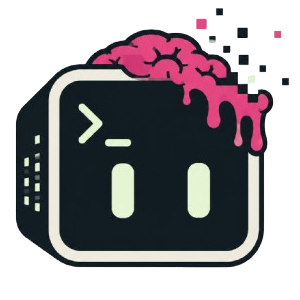

<div align="center">



# rotpilot

**claude works, you rot.** 

<!-- [](https://nodejs.org) -->
[](./LICENSE)


</div>

rotpilot is a Claude Code companion (Codex and OpenCode support might come soon). While Claude is working, it plays short-form video **inside your terminal**, in a proper 9:16 portrait crop, as a side panel right next to Claude's output so you can pretend you're still supervising. The moment Claude needs a permission or finishes, the panel collapses, a ding plays, and focus snaps back to Claude. The AI is babysitting your attention span: it feeds you brainrot while it works and takes it away when it needs you.

<p align="center">
  
</p>

Your rot is tracked. `rotpilot stats` shows the damage.

<p align="center">
  
</p>

## Install

```sh
npm install -g rotpilot
rotpilot init
```

Then run Claude Code **in kitty or Ghostty**, give it something chunky, and rot. The daemon boots itself and the feed starts the moment you submit a prompt — even thinking time is rot time.

**Restart any running Claude sessions after `rotpilot init`** — hooks load at session start.

**Ghostty (≥1.3)** works out of the box. **kitty** needs remote control on for the side-panel mode — paste this, then restart kitty:

```sh
grep -q '^listen_on' ~/.config/kitty/kitty.conf 2>/dev/null || printf 'allow_remote_control socket-only\nlisten_on unix:/tmp/kitty\n' >> ~/.config/kitty/kitty.conf
```

Without it, rotpilot falls back to a separate kitty window.

Want to see it work first? `rotpilot demo` — 30 seconds of the full loop, no Claude needed.

## Controls

Click the panel to focus it, then:

- **↑ / ↓** — scroll the feed by hand; auto-advance re-times itself around where you land
- **p** — pause it yourself. It *stays* paused; Claude getting back to work won't undo it
- **r** — resume, out of any pause
- **q** / **esc** — close the TV and the engine Chrome, snoozing until your next prompt

rotpilot is **per-project and terminal-only**. `rotpilot on` / `off` toggles the current project (hooks live in that project's `.claude/settings.local.json`, never your global settings), and it only activates when Claude runs inside kitty or Ghostty — the desktop app and IDE extensions never trigger it.

## Commands

| command | what |
|---|---|
| `rotpilot init` | install hooks into Claude Code (idempotent; `rotpilot off` to remove) |
| `rotpilot demo` | 30 seconds of the full loop, no Claude needed |
| `rotpilot stats` | your rot report — rot ratio, rot by weekday, trend, budget meter. screenshot it, you coward |
| `rotpilot recap` | what you missed this session, plus everything still waiting on you |
| `rotpilot budget <amount>` | a rot ration stats holds you to — `10m`, `1h --weekly`, `off` |
| `rotpilot engram` | the optional cross-session memory (`key` / `id` / `transcripts on\|off` / `check`) |
| `rotpilot feed <name>` | `localLoop` \| `shorts` \| `instagram` (`--accept-risk` to opt into Instagram) |
| `rotpilot loop` | optional: fetch the Subway Surfers clip `localLoop` plays (~20 MB, yt-dlp) |
| `rotpilot window <mode>` | `panel` (split beside Claude, default) \| `window` (separate) |
| `rotpilot on` / `off` | per-project switch |
| `rotpilot status` / `start` / `stop` | daemon control |
| `rotpilot uninstall` | full cleanup: daemon, Chrome, hooks, and all local data |

## Feeds

- **`localLoop`** (default) — network-free, zero accounts. Drop your own video at `~/.config/rotpilot/loop.mp4` and it plays that.
- **`shorts`** — real YouTube Shorts, auto-advancing at a human pace.
- **`instagram`** — your actual Reels. **Opt-in, at your own risk**.

## What you missed

Every snap-back is recorded locally. `rotpilot recap` prints two sections: **this session**, read straight from the Claude transcript and written up by your own `claude` CLI — no key, nothing leaves your machine — and **still on you**, the standing to-do list of everything Claude asked while you weren't looking, across every repo and session.

That second half needs [Engram](https://docs.weaviate.io/engram), which is opt-in and off by default, because Claude Code's transcripts rotate and take their unanswered questions with them.

→ **[Memory & recap](./docs/memory.md)** · **[Engram Quickstart](./docs/engram-quickstart.md)**

## Requirements

- **macOS**, **Node 20+**, **Google Chrome** (the video engine — an isolated headful profile, never your own)
- **[kitty](https://sw.kovidgoyal.net/kitty/)** or **[Ghostty](https://ghostty.org) ≥1.3** — the only terminals with APIs for all three things the panel needs: graphics, focus control, and pane spawning
- **[yt-dlp](https://github.com/yt-dlp/yt-dlp)** (optional) — only for `rotpilot loop`. Without it `localLoop` plays a built-in animation

## Docs

- **[How it works](./docs/how-it-works.md)** — hooks, Chrome, the daemon, terminal support
- **[Memory & recap](./docs/memory.md)** — local recap, budgets, Engram
- **[Engram Quickstart](./docs/engram-quickstart.md)** — the opt-in cross-session memory
- **[Config](./docs/config.md)** — every setting, and the performance levers

## Roadmap

- **v2** — plays lofi when you're being productive, as punishment
- **v2.1** — `rotpilot stats --resume` formats your rot as a bullet point for your CV
- **v3** — emails your rot-minutes to your manager every Friday
- **v3.5** — detects you watching brainrot on your *phone* during the brainrot and snaps that back too
- **v4** — rotpilot for meetings: plays Subway Surfers under your webcam feed until someone says your name
- **v5** — the model refuses to fix your bug until you've watched three more reels. engagement-gated engineering

## Uninstall

```sh
rotpilot uninstall     # stops everything, removes hooks, wipes all local data
npm uninstall -g rotpilot
```

`--keep-data` preserves your config and rot history but always wipes the Chrome profile (it can hold real logins). Save your Engram memory id first — `uninstall` prints it, and it's the one thing you can't get back.

Your dignity does not come back with it.

---

MIT. Not affiliated with Anthropic, Google, Meta, or anyone else on this planet.
